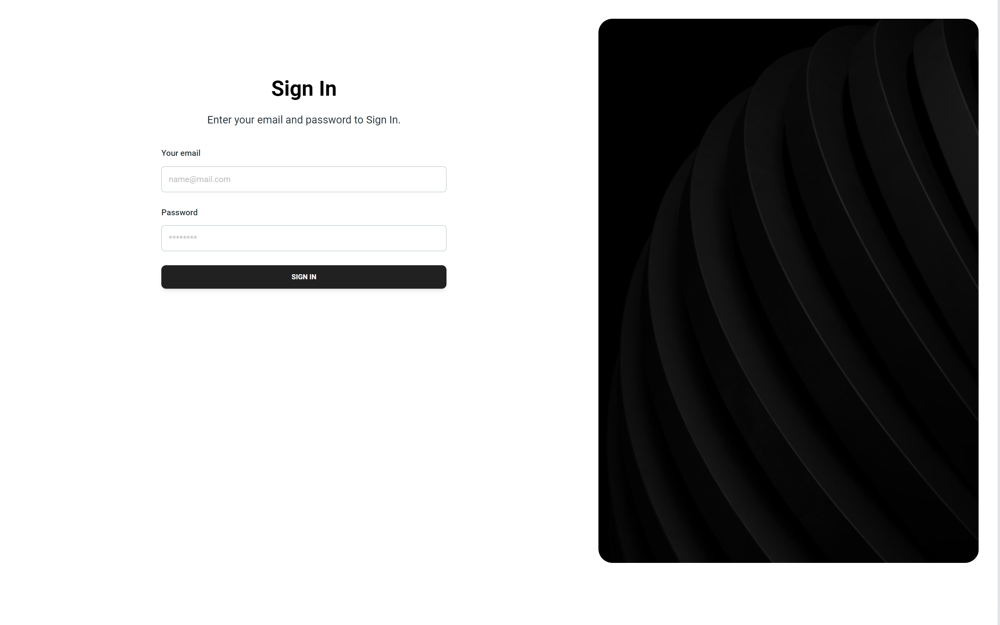
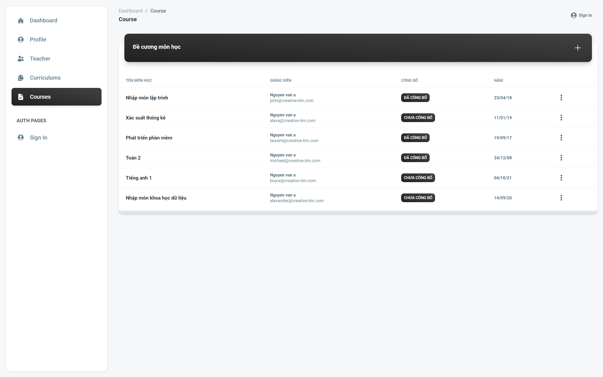
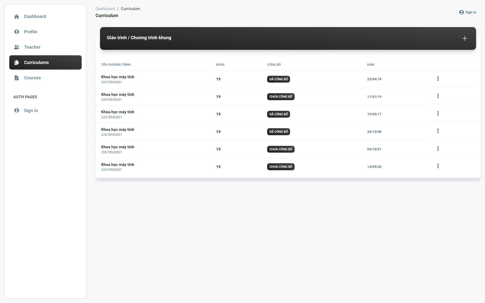
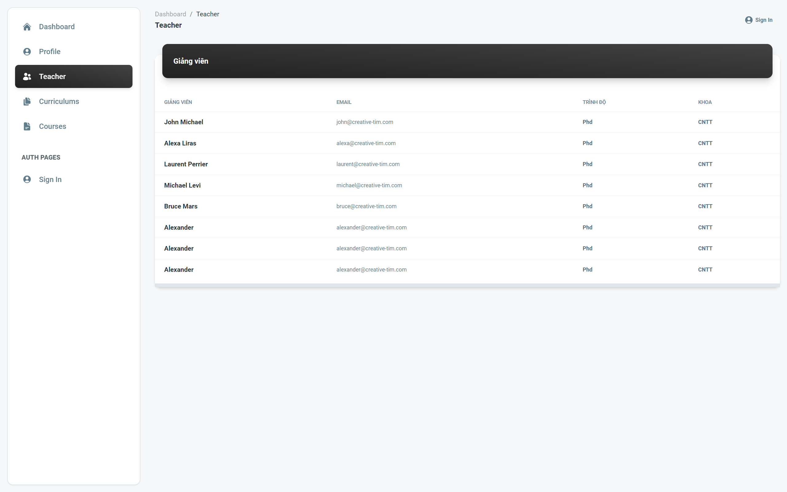
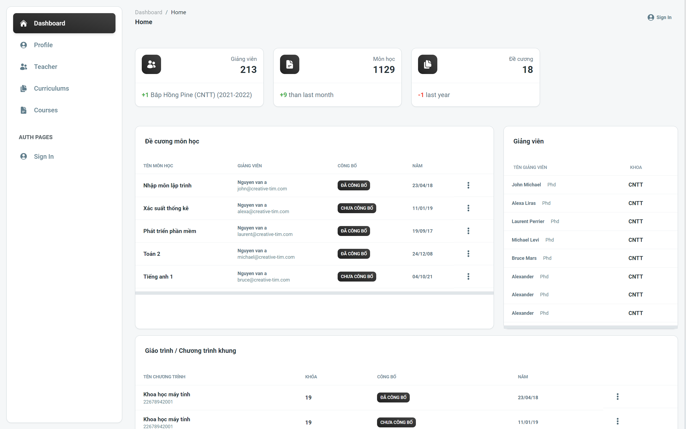

## 4. HIỆN THỰC
Team có đủ kiến thức để thực hiện các chức năng đơn giản

### 4.1. Công nghệ sử dụng
Front-end: ReactJS, HTML, CSS, Bootstrap, Material UI, Ant Design, tailwindcss
Back-end: Django, postgreSQL, RESTful API

Kết nối giữa front-end và back-end: Axios, Fetch API

### 4.2. Giao diện ứng dụng

### 4.3. Kết quả

- Làm được:
    + Đăng nhập
    + CRUD đề cương
    + CRUD chương trình đào tạo
    + Phân công giảng viên
    + Thống kê
    + Tìm kiếm
    + Xuất file

- Chưa làm được
    + Phê duyệt đề cương
    + UI còn khó 

- Hướng phát triển
    + Sử dụng dễ dàng
    + UI/UX tốt hơn
    + BE tối ưu hóa